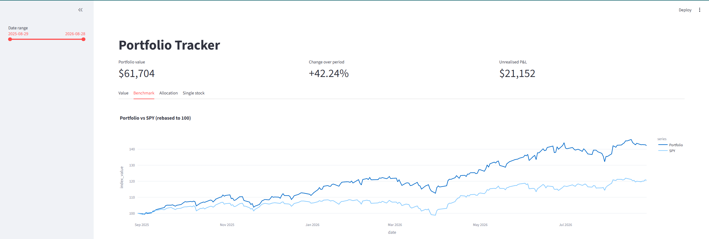
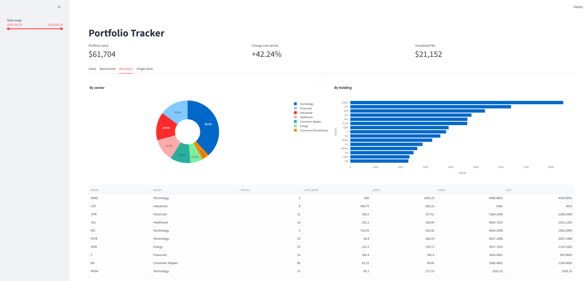
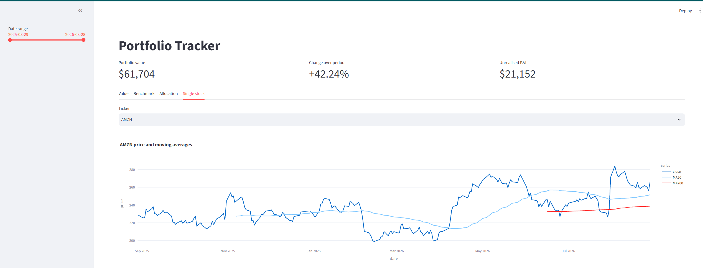

# Portfolio Tracker

An interactive dashboard for analysing an equity portfolio — daily valuation, benchmark comparison, sector allocation, and per-stock technical indicators.

Built as a proof-of-concept ahead of my final year project on data analysis and visualisation.






## Features

- **Portfolio valuation** — daily total value derived from end-of-day price data and current share counts
- **Benchmark comparison** — portfolio performance against the S&P 500 (SPY), both rebased to 100 for like-for-like comparison
- **Allocation analysis** — breakdown by sector and by individual holding, with unrealised P&L per position
- **Single-stock view** — price history with 50-day and 200-day moving averages
- **Date range filtering** across all views

## Tech stack

| Layer | Tool |
|---|---|
| Data source | yfinance (Yahoo Finance) |
| Storage | SQLite |
| Processing | pandas |
| Visualisation | Plotly |
| Interface | Streamlit |

Built and tested on Python 3.12.

## Architecture

Price data is fetched from Yahoo Finance and persisted to a local SQLite database rather than re-fetched on each run, so the dashboard reads from disk instead of hitting the API on every interaction.

The `prices` table carries a `UNIQUE(ticker, date)` constraint, and inserts use `INSERT OR IGNORE`. Re-running the fetch script therefore appends new trading days without creating duplicates. Note that this also means existing rows are never updated — if Yahoo revises a historical price, or a stock split changes the adjusted series, those rows will keep their original values until the affected data is deleted and re-fetched.

Holdings are defined in `holdings.csv`, keeping portfolio data separate from application logic.

## Setup

```bash
git clone https://github.com/Divij-05/portfolio-tracker.git
cd portfolio-tracker

python -m venv venv
venv\Scripts\activate        # Windows
source venv/bin/activate     # macOS/Linux

pip install -r requirements.txt
```

Edit `holdings.csv` to reflect your own positions — ticker, share count, cost basis per share, and sector. The version in this repository contains illustrative holdings, not real positions.

Then run the three steps in order. The database file is not committed, so the first two are required before the dashboard will work:

```bash
python database.py           # create the SQLite schema
python fetch_data.py         # fetch one year of price data for each holding
streamlit run app.py         # launch the dashboard
```

`check_data.py` can be run at any point to verify what landed in the database — row counts and date coverage per ticker.

## Files

| File | Purpose |
|---|---|
| `database.py` | Creates the SQLite schema |
| `fetch_data.py` | Fetches price data and writes it to the database |
| `check_data.py` | Data quality checks — row counts and date coverage per ticker |
| `analysis.py` | Prototyping scripts the dashboard was developed from; renders the portfolio value and benchmark charts standalone |
| `app.py` | Streamlit dashboard |
| `holdings.csv` | Portfolio definition (ticker, shares, cost basis, sector) |

## Known limitations

- **Valuation method.** Current share counts are applied across the entire price history, so the portfolio series reflects how today's basket would have performed over the period. It is not a transaction-level return series and does not account for when positions were actually opened or changed.
- **Data freshness.** Yahoo Finance provides end-of-day data, and the dashboard reads from a static local database. Prices are only as current as the last `fetch_data.py` run.
- **Moving averages.** With one year of data (~251 trading days), the 200-day moving average is only defined for roughly the final 50 days. Narrowing the date range shortens it further.
- **Series alignment.** The benchmark comparison combines the portfolio and SPY series positionally rather than joining on date. This holds while every ticker shares an identical trading calendar, but would need a date-based merge to support instruments with differing calendars.
